# SERVLET_JSP 20200973 김영재
[쇼핑몰 웹페이지](https://jsp-main--wprvs.run.goorm.site/index.jsp)

### 2023년 9월 6일 : 프로젝트 환경 설정, HELLO WORLD 확인 안료, 쇼핑몰 메인 페이지 - 2주차

기존 index.jsp 파일 body태그 안으로 부트스트랩 ui를 적용하여 메뉴바와 점보트론, 텍스트 컨테이너, 하단 영역을 만들었다.
한글 깨짐 문제를 해결하기 위해서 파일의 첫 시작은 페이지 지시자를 사용하여 HTML 콘텐츠를 생성하겠고, UTF-8 문자 집합을 사용한다고 정하였다.
최하단 상태바에 날짜를 출력하는 자바 코드를 스크립트 릿 안에 작성하였고, 자바 라이브러리를 사용하기위해 import문을 사용하여 클래스 컴파일 에러 문제를 해결하였다.

### 2023년 9월 13일 : 쇼핑몰 메인 페이지 모듈화 완료 - 3주차

2주차에 만들었던 index.jsp의 메인화면을 파일로 분리했다.
기존 index.jsp에서 body태그안에 내용을 include 지시문을 사용하여 파일을 불러오는 것으로 수정하였다.
기존 부트스트랩 링크를 새로운 링크로 업데이트해주고, index.jsp의 메인화면을 3가지로 분류하였다.
top_menu.jsp에는 index.jsp에 작성하였던 메뉴바를 넣어주고, body_main.jsp에는 텍스트 컨테이너를 넣어주고, 
footer.jsp에는 날짜를 출력하는 최하단 상태바를 넣어주었다.
주제를 의류 쇼핑몰로 잡아 의류 쇼핑몰에 어울리는 이미지 배너를 1개 다운받아 image 폴더를 만들어 업로드하였다.
최상단 배너 영역을 따로 분리하여 top_banner.jsp를 만들었다. index.jsp에는 top_banner.jsp를
include 지시문을 사용하여 파일을 불러오게 하였고, top_banner.jsp는 img태그를 작성하였다.
top_menu.jsp의 메뉴바에 드롭다운 메뉴를 추가하고 로고 이미지를 삽입하였다.
그리고 로고 이미지 옆에는 가로로 로그인, 회원가입, 고객센터 메뉴가 나열되게 하였다.
body_main.jsp에는 큰 텍스트를 넣고 하단 오버레이 이미지를 직접 만들어 img태그 안에 넣고,
오버레이 이미지 아래에는 목록 그룹을 만들었다.
최하단 footer.jsp에는 이름, 학번, 이메일 주소를 작성하였고, 현재 접속 시간을 알려주는 2주차에 사용했던
스크립트 릿 안 Date 코드를 가져와 작성하였다.
index.jsp에 현재 페이지 버퍼 용량과 남은 페이지 버퍼 용량을 알려주게 버퍼 처리를 하였다.
 
 
 * 연습문제 -> 기존 jsp 파일 스크립트 릿 안에 작성하였던 시간 출력 코드는 새로운 java 파일을 만들어 분리시켰다.
그리고 footer.jsp 헤더부분에 import문으로 이 코드를 가져오게 하여 출력하게 하였다. 그렇지만  강의안대로 시간 출력 코드를 작성할 시 정확한 대한민국의 시간이 뜨지 않아 새로운 코드로 작성하였다.
패키지를 선언하고, 라이브러리를 임포트하고, 한국 표준시로 시간대를 설정하고 Calendar 클래스를 사용하여 
현재 시간을 시, 분, 초로 분리한 후 최종 시간 문자열을 만들어 반환하였다.
아래 사진은 WEB-INF/src/example/ShoeTime.java 파일의 코드이다.
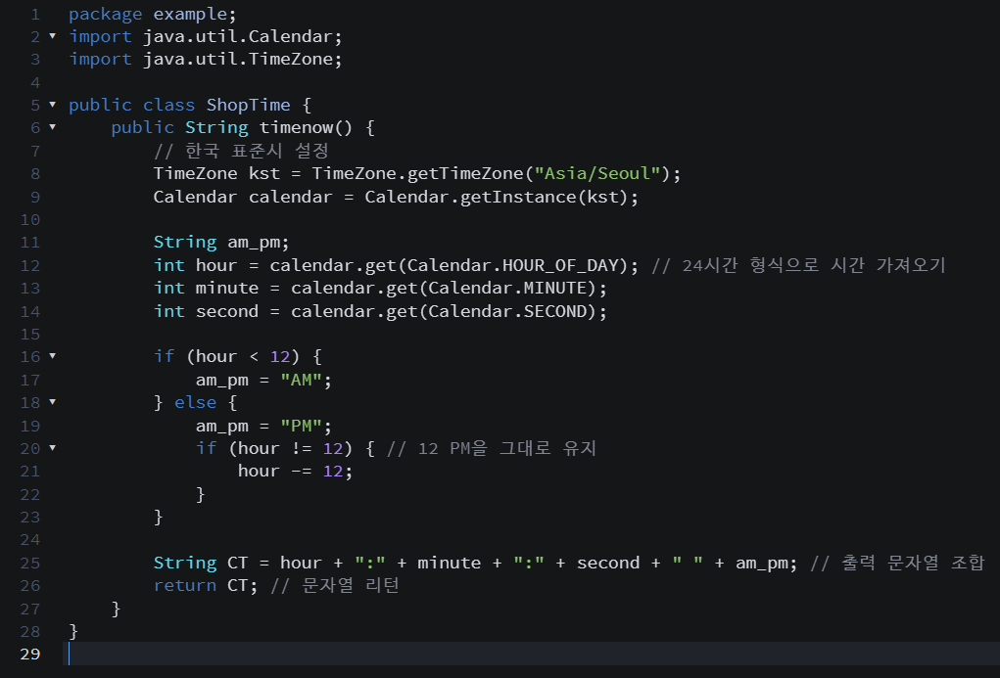

### 2023년 9월 27일 : 쇼핑몰 상품 목록 페이지 추가 - 5주차

상품화면을 오버레이 이미지 위에 추가하였다. 상품 목록을 멤버 변수로 정의해주는 Product.java와 상품을 저장하는 ProductRepository.java 파일을 만들었다.
dto 패키지를 생성하여 Product.java 파일을 만들고 상품 아이디, 상품명, 상품 가격 등을 변수로 정의하고 set, get 메소드를 구현하였다.
dao 패키지를 생성하여 ProductRepository.java 파일을 만들고 dto 패키지의 Product를 가져와 상품을 저장하였다. 원하는 제품으로 상품 3개를 입력하였다.
body_main.jsp를 수정하는데 dto 패키지의 Product 패키지 연동을 해주고, 자바 빈 클래스를 설정하였다. ArrayList를 이용하여 리스트에 상품 전체 정보를 얻어와 출력하게 하였다.
 
 
* 연습문제 -> 같은 방법으로 6개의 상품을 더하여 총 9개의 상품을 저장하여 출력하였다.
기존 image 폴더에 product 폴더를 만들어서 9개의 이미지를 저장하였다. 그리고, 자바 빈즈를 활용하여 이미지를 추가하였다.
아래 사진은 image/product/P1234~P1242의 사진이다.

### 2023년 10월 4일 : 쇼핑몰 상품 상세 페이지 추가 - 6주차

5주차에 만든 ProductRepository.java 파일을 수정하였다.
기존에는 getAllProducts 메소드로 전체 상품 정보를 리턴했는데 링크 클릭을 통해 요청된 상품 id를 리턴하는 새로운 메소드를 추가하였다.
Product 객체를 저장하는 리스트 listOfProducts를 순회하여 각각의 객체에 대해 productId가 일치하는지를 확인하는 코드를 구현하였다.
body_main.jsp를 수정하여 마우스로 링크를 클릭하면 새로운 페이지가 뜨는 기능을 구현하였다.
새로운 파일 product_detail.jsp를 만들었는데 이 파일은 상/하단 메뉴를 포함하여 index.jsp와 동일한 화면을 보여주게 하였다.
index.jsp와 다른 점은 이 파일은 상품의 상세 정보만 표시한다는 것이다. 내장 객체를 활용하여 정보를 받았다.
정상적이지 않은 상품 또는 id가 잘못 전달될 수 있기 때문에 이를 위해 예외 처리를 위한 exception 폴더를 만들어 product_not_found.jsp 파일을 생성하였다. 이 파일은 top_banner.jsp 파일과 top_menu.jsp 파일을 include하여 메뉴바를 index.jsp 파일과 동일하게 하였다. 화면에 뜨는 글만 바꿔서 에러 페이지로 만들었다.
 
 
* 연습문제 -> 전체 상품 상세페이지, 메인 페이지도 예외처리 하였다. index.jsp에 대한 예외처리 페이지를 만들었다.
web.xml에서 error-page, error-code:404, location 태그를 사용하고 파일명은 exception 폴더 안에 main_server_downtime.jsp를 만들어 입력했다.
만들어진 예외처리는 주석처리를 하여 현재 실행되게 해두지는 않았다.
아래 사진은 page에 잘못 접근했을 때 뜨는 예외처리 페이지이다.
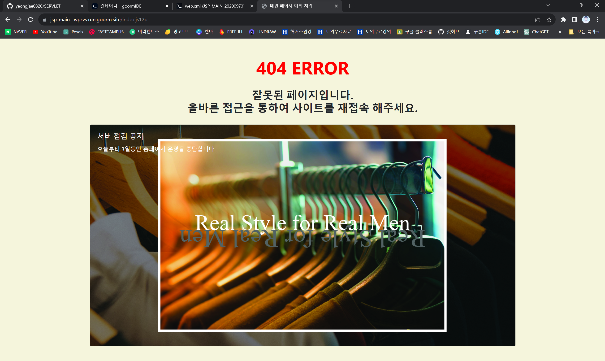

### 2023년 10월 11일 : 쇼핑몰 상품 등록 추가 - 7주차

지금까지 만든 파일들은 사용자용 페이지들인데, 관리자용 페이지를 생성하였다.
admin 폴더를 생성하고 기존 파일들을 복사하여 파일 이름들의 뒤에 ad를 추가하여 관리자용 파일로 명명하였다.
top_menu.jsp에 메뉴 링크를 관리자모드 하나 추가하였고, 클릭하면 index_ad.jsp 파일로 가게 하였다.
관리자용 메인 페이지의 메뉴 링크를 모두 수정해주었고, product_add.jsp 파일을 새로 작성하였다.
쇼핑몰의 상품을 등록하는 폼 화면이다. post 방식으로 전송하였다.
product_add_process.jsp를 만들어 Prouct, ProductRepository 클래스를 import하였고, request.getParameter()를 사용하여 폼으로부터 전송된 데이터를 각각의 변수에 저장하였다. 마지막은 index_ad.jsp 페이지로 리다이렉트하였다.
ProductRepository.java를 수정하였는데, 데이터 추가를 위해 객체 변수 인스턴스를 사용하였다.
또, body_main.jsp 파일에서 기존에 사용했던 자바 빈즈를 제거하고 import 방식으로 dao 패키지의 ProductRepository를 import 하는것으로 수정하였다. 현재 생성된 객체의 상품 목록을 출력하게 하였고, 파일 및 폴더 변경으로 경로를 수정하였다.
product_detail_ad.jsp는 기존에 상품 상세 페이지로 또한 자바 빈즈를 제거하고 import 방식으로 변경하였다.
Product.java와 ProductRepository.java 파일에서 이미지 파일 추가를 위해 파일명 변수와 Set, Get 메소드를 추가하였다.
body_main.jsp 파일의 메인 화면 이미지 로드 부분에서 product 객체의 getFilename() 메서드를 호출하여 해당 제품의 이미지 파일 이름을 가져온 후 그 값을 사용하게 코드를 바꿔주었다.
파일 업로드를 위한 라이브러리 cos.jar을 lib 폴더 안에 업로드하였다. 그리고 product_detail.jsp 파일에서도 이미지 로드 부분을 동일하게 바꿔주었다.
product_add.jsp 파일에서 파일 업로드를 위해 폼 전송 타입을 바꿔주었고, 이미지를 등록할 수 있게 input type file을 만들어주었다.
product_add_process.jsp에서 라이브러리 사용을 위해 import문을 추가하고 파일 업로드에 필요한 각 변수를 초기화하였다. realFolder로 웹 어플리케이션 상의 실제 경로를 얻어와 인코딩 타입과 최대 업로드 파일 크기를 설정하였다. 파일 업로드 시 동일한 이름의 파일이 존재하는지, 파일 이름을 자동으로 변경하는 정책을 제공하는 클래스를 사용하였고, 파일 업로드를 처리하기 위해 MultipartRequest 클래스를 사용하였다.

### 2023년 10월 25일 : 쇼핑몰 로그인 기능 추가 - 9주차

입력값을 필터링해주는 validation.js 파일을 최상위에 js 폴더를 새로 만들어 그 안에 추가하였다.
각각의 입력 폼 요소를 getElementById 메소드를 사용하여 가져와 상품 코드를 정규 표현식으로 검사하였다.
상품 가격과 재고 수를 체크하고 폼을 제출하는 코드를 구현하였다.
product_add.jsp 파일에 validation.js 파일을 연동하였고, 자바 스크립트 체크를 위해서 상품 코드, 상품명, 가격, 재고 수의 id 값을 수정하였다.
.XML 파일을 수정하였다. 탐캣 내 파일을 수정하였다. 그룸 ide 터미널 상에서 직접 리눅스 vi를 이용하였다. cd 명령으로 폴더 이동을 하여 tomcat_users.xml 파일을 확인하였다.
이 파일을 수정하기 전에 먼저 원본 파일을 백업하였고 수정사항으로는 주석을 삭제하여 코드를 활성화시키고 내용을 수정하였다. vi tomcat-users.xml을 입력하여 del 키로 주석을 삭제한 것이다.
수정하는 방법으로 키보드 a를 눌렀고, rolename과 username으로 admin을 추가하여 admin에 대한 아이디와 비밀번호를 추가하였다.
수정을 완료하여 shift와 콜론을 동시에 누르고 wq를 입력하고 엔터를 하여 수정을 완료하였다.
탐캣 서버를 재시작하고 web.xml을 수정하였다. adminㅇ 대한 보안 규칙을 추가하기 위해 security-role태그에 admin을 추가하고, url-pattern태그로 제약 조건이 적용될 url 패턴을 지정해주었다.
그리고 웹 리소스에 대한 접근 권한도 admin 역할만 접근할 수 있도록 제한해주었다.
로그인 설정을 정의하고 form 인증 방법에 대한 추가적인 구성을 지정하는 태그를 추가하였다.
기존 top_menu.jsp 파일을 수정하였다.
login.jsp와 login_failed.jsp 파일을 새로 추가하였다.
로그인과 로그인 실패 페이지이다. 최상위 login 폴더를 만들어서 그 안에 생성하였다.
보안 인증에 action으로 j_security_check를 지정하였다.
로그인이 실패하면 다시 로그인 페이지를 로딩하는 코드를 작성하였고, 
logout.jsp를 새로 생성하여 로그아웃 버튼을 클릭하면 invalidate()를 사용하여 현재 세션 객체를 전체 삭제하고 상품 등록 페이지인 product_add.jsp파일로 sendRedirect하였다.
로그아웃 버튼은 상품 등록 페이지의 등록 버튼 아래에 추가하였다.
 
 
* 연습문제 -> 관리자 페이지 메뉴를 클릭하면 로그인을 수행하도록 변경하였다.
role은 admin으로 동일하고, 비밀번호를 123123에서 123654로 변경하였다. 서버 내 설정 파일도 수정해주었다.
상품 등록 페이지의 로그아웃 버튼을 없앴고, 
관리자용 페이지 메뉴바에 로그아웃 메뉴를 만들어 관리자용 페이지에 접근하고 나서 로그아웃을 원하면 굳이 상품 등록 페이지로 가지 않고 바로 로그아웃 할 수 있게 하였다.
아래 사진은 비밀번호를 123654로 수정하고 관리자모드를 누르면 아이디, 비밀번호를 입력하는 페이지가 뜨는 사진이다.
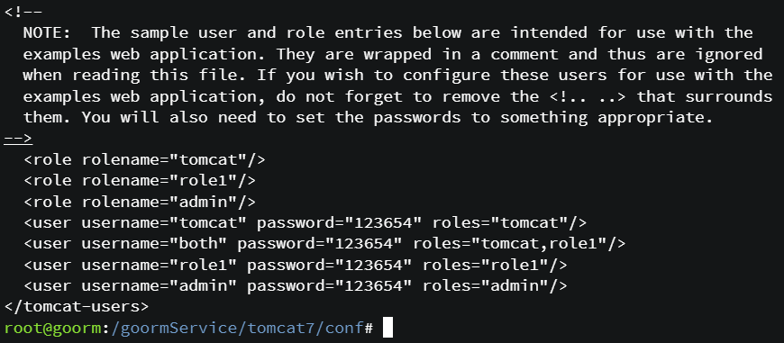
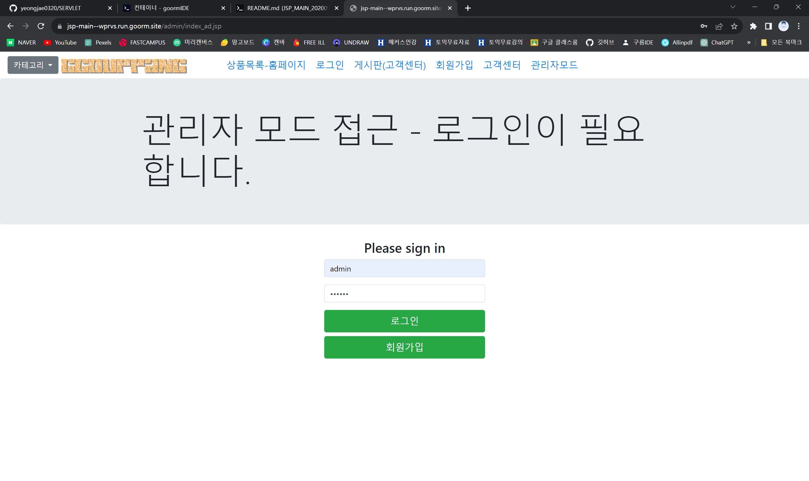

### 2023년 11월 1일 : 세션 및 장바구니 기능 추가 - 10주차

Product.java 클래스를 수정하였다. 기존 코드에 장바구니에 담은 개수를 담을 멤버 변수를 추가하고, set, get 메소드를 추가하였다.
product_detail.jsp 파일을 수정하였다. 장바구니 추가를 묻는 알림창 기능을 가진 함수를 confirm 함수를 사용하여 script 태그 안에 구현하였다.
그리고, 기존 상품 목록 옆에 상품 주문을 삭제하고, 상품 주문하기, 장바구니 링크를 추가하였다.
cart 폴더를 생성하고 장바구니 등록 페이지인 product_cart_add.jsp 파일을 생성하여 ArrayList, Product, ProductRepository 클래스를 가져와 request 요청으로 제품 id를 가져왔다.
또, 제품을 검색하여 찾을 수 없으면 product_not_found 페이지로 리다이렉트하고, 모든 제품을 가져와서 세션에 저장된 사용자의 장바구니를 업데이트하였다.
장바구니 화면 페이지인 product_cart.jsp 파일을 생성하여 리스트 상품 정보로부터 가격과 수량으로 가격 총액을 계산하는 페이지로 만들었다.
장바구니에서 삭제하는 기능을 담은 페이지 product_cart_remove.jsp를 만들었다. 제품 id를 가져오고 인스턴스를 생성하고, 제품을 검색하고, 장바구니 목록을 가져와 제품을 찾아 제거하고, 삭제한 후 product_cart.jsp 페이지로 리다이렉트하는 코드를 구현하였다.
product_cart_remove_all.jsp 페이지는 cartid 매개변수를 장바구니 아이템에서 가져와 상품의 전체 목록을 삭제하는 기능을 구현하였다. 전체 삭제하기 버튼을 누르면 session.invalidate()에 의해 다른 값으로 초기화된다.
 
 
* 연습문제 -> 첫 번째, 날짜 관련하여 클래스 에러가 나지는 않았지만, footer.jsp에 직접 클래스 연동을 추가하였다.
그리고 두 번째, 장바구니 페이지 상단 로그 이미지가 깨지기 때문에 cart용 image 폴더를 새로 만들어서 경로를 수정해주었다.
세 번째, 세션을 전체 삭제하고 뒤로 가기 한 다음 다시 특정 상품을 선택하여 삭제를 하면 에러가 난다.
이것을 해결하기 위해 기존 product_cart_remove.jsp 파일에서 
장바구니 목록이 null인지 확인하는 if (cartList == null)을 하여 
장바구니 목록이 null이거나 아직 생성되지 않은 경우 ArrayList를 생성하고 새로 생성한 또는 이미 존재하던 cartList를 세션에 cartList라는 키로 설정해주는 코드를 추가 구현해주었다.
이로써 에러가 더이상 발생하지 않는다. 네 번째, 일반 상품 상세 페이지와 관리자 페이지의 상세 페이지는 경로가 살짝 다르기 때문에 수정을 해주었다.
아래 사진은 cart/product_card_remove.jsp 파일에서 상품 삭제 오류를 해결한 코드이다.
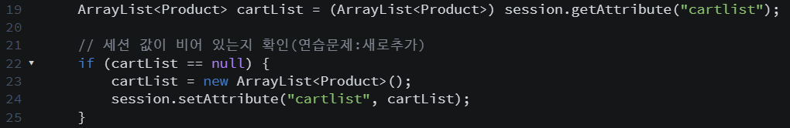

### 2023년 11월 8일 : 쇼핑몰 주문 처리 페이지 추가 - 11주차

기존 장바구니 페이지인 product_cart.jsp의 주문하기 링크를 수정하였다.
최상위에 order 폴더를 새로 생성하고 order_info.jsp 파일을 생성한다.
이 order_info.jsp 파일은 배송 정보를 입력하는 화면으로 폼을 post 방식으로 order_info_process.jsp로 보낸다.
받아온 cartId 매개변수의 값을 숨겨진 입력 필드에 설정하여 폼 데이터를 전송하였다.
폼은 성명, 배송일, 국가명, 우편번호, 주소를 묻고 그 아래에 이전, 등록, 취소 버튼을 만들었다.
이전 버튼을 누르면 장바구니 페이지로 전환하고, 취소 버튼을 누르면 주문취소 페이지로 전환한다.
order_info_process.jsp를 생성하였다. 이 파일은 각각의 주문 정보를 처리하기 위해 쿠키를 생성하고, 값을 UTF-8로 인코딩하여 저장한다.
각 쿠키의 수명을 설정하고, 생성된 쿠키들을 response에 추가한다.
마지막으로 모든 작업이 완료된 후에는 order_confirm.jsp로 리다이렉트한다.
order_confirm.jsp 페이지는 이전 페이지에서 설정한 쿠키 값을 읽어와서 변수에 저장하는 코드로 구현되었다.
필요한 Java 클래스들을 import하고, 세션에서 고유한 세션 id를 가져와 변수에 저장한다.
그리고 쿠키에서 읽어온 값을 저장할 변수들을 초기화한다.
request.getCookies()를 사용하여 모든 쿠키를 가져오고, 각 쿠키의 이름을 확인하여 필요한 정보를 변수에 저장하였다.
그리고, 변환 완료된 이름, 우편 번호, 주소 등 앞 페이지에서 입력한 정보를 화면에 출력하게 하였다.
세션으로부터 cart 정보를 얻어 가격을 계산해주었다.
주문한 제품들의 목록을 표로 표시하고, 총액을 계산하여 출력하는 페이지로 구현되었다는 것이다.
주문을 완료하면 다음 페이지로 넘어가는 것 또한 구현해야 하기 때문에 order_end.jsp 페이지를 만들었다.
이 파일은 현재 요청에 대한 모든 쿠키를 가져와 기존 세션과 쿠키를 삭제하는 기능이 포함되어 있다.
결국 주문이 완료되면 현재 세션을 무효화시키고, 각각의 쿠키를 확인하여 해당 쿠키의 수명을 0으로 설정하여 삭제하였다.
또, 주문취소 페이지인 order_cancelled.jsp 파일을 만들어 추가적인 코드를 구현하지 않고 단순히 주문을 취소하겠다는 글만 화면에 표시되게 하였다.
 
 
* 연습문제 -> 첫 번째, 배송일을 날짜를 선택하여 입력하도록 수정하였다.
단, 조건이 있는데 입력 날짜가 반드시 당일을 선택할 수 없게 하고 내일 이후여야 한다.
일반적으로 type을 date를 사용하게 되면 당일을 선택할 수 있다. 당일도 선택이 안 되는 것이 목표였다.
이를 js로 구현하였는데, order_info.jsp 파일에 구현하였다.
기존에 사용하던 input 태그의 text type의 날짜를 date로 하여 날짜를 선택할 수 있게 하고, 
name 속성이 'shippingDate'로 설정되어 있어 폼을 제출할 때 해당 날짜 정보가 서버로 전송된다.
id 속성은 'shippingDate'로 설정되어 있어 JavaScript 등에서 해당 요소를 식별할 때 사용할 수 있다.
min 속성은 사용자가 선택할 수 있는 최소 날짜를 지정한다.
여기서는 현재 날짜(java.time.LocalDate.now())에 1일을 더한 날짜로 설정되어 있어, 현재 날짜 이후의 날짜만 선택할 수 있게 하였다.
onchange 속성은 사용자가 날짜를 선택한 후 발생하는 이벤트에 대한 핸들러를 정의한다.
여기서는 'validateDate()' 함수를 호출하도록 설정되어 있다.
validateDate() 함수에서는 사용자가 입력한 날짜 값을 가져와 Date 객체로 변환하고, 현재 날짜를 나타내는 Date 객체를 생성한다.
현재 날짜의 시간을 00:00:00으로 설정하여 시, 분, 초, 밀리초를 모두 0으로 만들었다.
입력된 날짜가 현재 날짜보다 이전인 경우, '오늘 이후의 날짜를 선택해주세요.' 경고를 표시하고, 입력 필드의 값을 비운다.
입력된 날짜가 오늘과 같은 경우, "오늘은 선택할 수 없습니다." 경고를 표시하고, 입력 필드의 값을 비운다.
두 번째, 국가명을 Select 박스로 수정하여 한국, 중국, 일본, 미국 4가지를 선택할 수 있게 수정하였다.
세 번째, 우편 번호와 주소를 검색을 통해 입력되도록 수정하였다.
다음 주소 API를 활용하여 주소 검색 팝업을 띄우고 사용자가 선택한 주소 정보를 화면에 표시하는 함수를 구현하였다.
이 과정을 진행하면서 기존 order_info.jsp에서 우편번호 영역을 제거하였다.
아래 사진은 11주차 연습문제 내용이다.
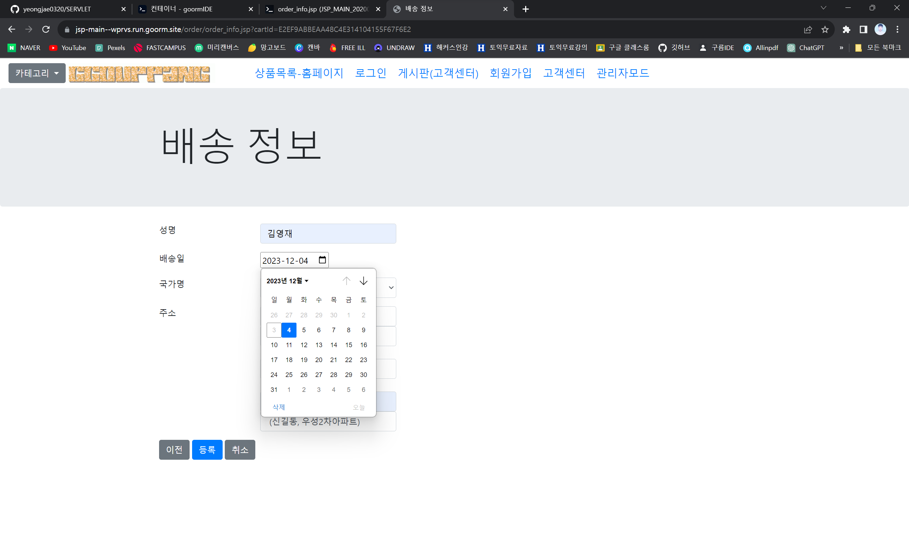
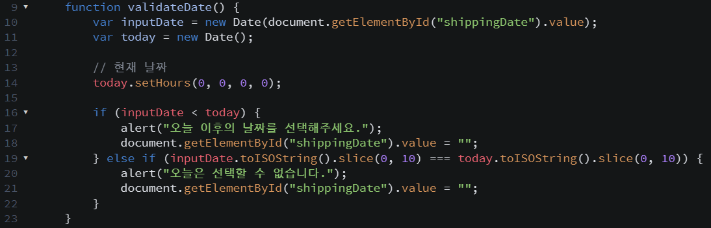
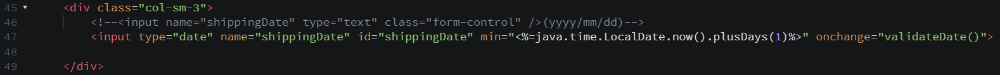
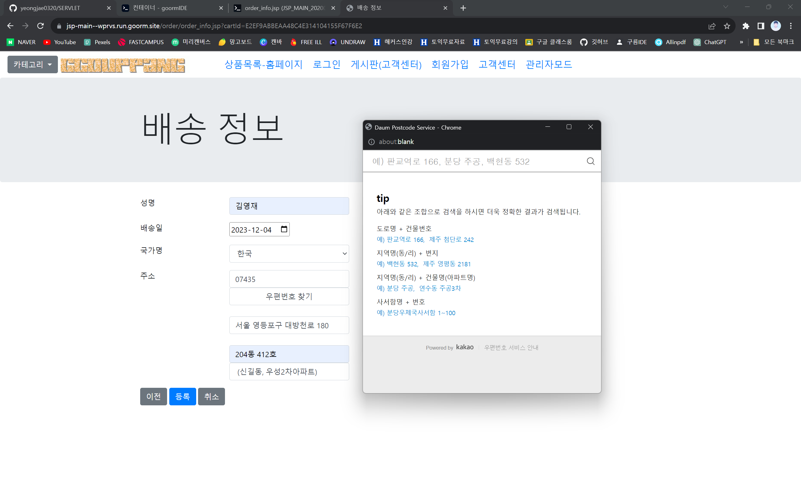

### 2023년 11월 15일 : 쇼핑몰 상품 관리 페이지 추가(1) - 12주차

새로운 컨테이너를 생성하였다. 그룸 ide 터미널에서 명령어를 입력하고 탐캣 라이브러리 폴더에 복사하였다.
초기 설치 이후 관리자 비밀번호를 설정해야 했다. 현재 root 패스워드는 비어있다.
mysql 서비스를 시작하기 위해서 service mysql start를 입력해주었고 보안 설정을 실행하여 비밀번호를 123123으로 설정하였다.
데이터베이스를 만들어주고 use문을 사용하여 데이터베이스 접근하였다.
product 테이블을 만들었다. column으로는 p_id, p_name, p_unitPrice 등으로 해주었다.
product 테이블에 데이터를 삽입하였다. insert문을 사용하여 기존에 ProductRepository.java에 저장했던 상품들의 id와 가격 등을 입력하였다.
conn_test.jsp 파일을 최상위 폴더에 생성하여 파일을 mysql 데이터베이스에 연결하고 
특정 테이블 product에서 데이터를 가져와 웹 페이지에 출력하게 하였다. statement 객체를 사용하여 sql 쿼리를 실행하고, 
결과를 ResultSet에 저장하였다. while문 루프를 통해 각 행의 데이터를 가져와 웹 페이지에 출력하는 것이다.
db 폴더를 생성하고 그 안에 db_conn.jsp 파일을 생성한다.
Connection, PreparedStatement, ResultSet 객체를 초기화하고 mysql jdbc 드라이버를 로드하였다.
기존 Statement보다 sql 쿼리문 구현이 훨씬 간결하다.
기존 top_menu.jsp 파일에서 가독성을 위해 메뉴 이름을 상품목록(기본 홈)으로 수정하였다.
body_main.jsp 파일에서 db 연동을 위해 sql 패키지를 추가하고 연결을 연동시켰다.
java.sql.을 import하고 db_conn.jsp 파일을 include 지시문을 사용하여 포함시켰다.
product 테이블을 조회하고 연결을 생성하고 rs 객체를 사용하여 쿼리를 실행시켰다.
또, 기존 리스트 코드 부분을 삭제하였다. 반복문이 끝난 이후는 db 연결을 종료시켰다.
product_add_procss.jsp에서 body_main.jsp파일처럼 db 연동을 위해 sql 패키지를 추가하고 연결을 연동시켰다.
로그인 에러가 생기기 때문에 기존 tomcat-users.xml 파일을 수정하기 위해 터미널 vi 연결하여 작업을 해주었다.
product 테이블에 데이터를 삽입하는 sql 쿼리를 정의하는데 values()안에 ?를 설정하여 나중에 바인딩할 매개변수를 나타내었다.
setString 메소드를 사용하여 각 ?에 대응하는 위치에 값을 설정해주었다.
executeUpdate 메소드를 호출하여 sql 쿼리를 실행하고, 데이터베이스에 변경을 적용하였다.
 
 
* 연습문제 -> 첫 번째, 데이터베이스 수정 작업을 하였다.
강의시간에는 상품 리스트 데이터를 3개만 추가하였는데 추가로 입력 안된 상품 정보 6개의 상품을 더하여 총 9개의 데이터를 만들었다.
두 번째, 관리자 패스워드를 변경해야했다. 그리고 변경이 되면 소스코드로 설정했던 패스워드도 변경해야했다.
먼저 service mysql start를 하여 기존 패스워드 123123으로 접속을 한 후 user mysql;을 입력하여 mysql 데이터베이스 접근하였다.
show tables;를 입력하면 여러 개의 table들이 뜨는데, 그 중에서 desc user;을 하면 user 테이블에 어떤 열들이 있는지 확인할 수 있다.
우리는 update 문을 통해 user의 password를 바꿔주어야 하는데, select user from user;을 확인해보면 root가 있는데 이 root의 비밀번호를 바꿔주었다.
select password from user;을 입력하고 보면 해싱된 패스워드 값들을 볼 수 있는데 이 패스워드를 123123에서 123654로 바꿔주는 것이 목표였고, 
바꿔주기 위해 다음과 같은 쿼리문을 입력하였다.
Update mysql.user SET password = password('123654') where user = 'root'; 이 코드는 user columne 값이 root인 것을 찾아서 password를 123654로 바꿔준다는 쿼리문이다.
select host from user;을 입력하면 host로 아이피와 ::1, localhost가 있는데, host에 대해서도 혹시 몰라 
Update mysql.user SET password = password('123654') where host = '';문을 사용하여 각 host에 대해서도 password를 바꿔주었다.
그리고 db_conn.jsp파일을 포함하여 password가 123123으로 저장했던 파일들을 123654로 바꿔주었다.
아래 사진은 12주차 연습문제 내용이다.
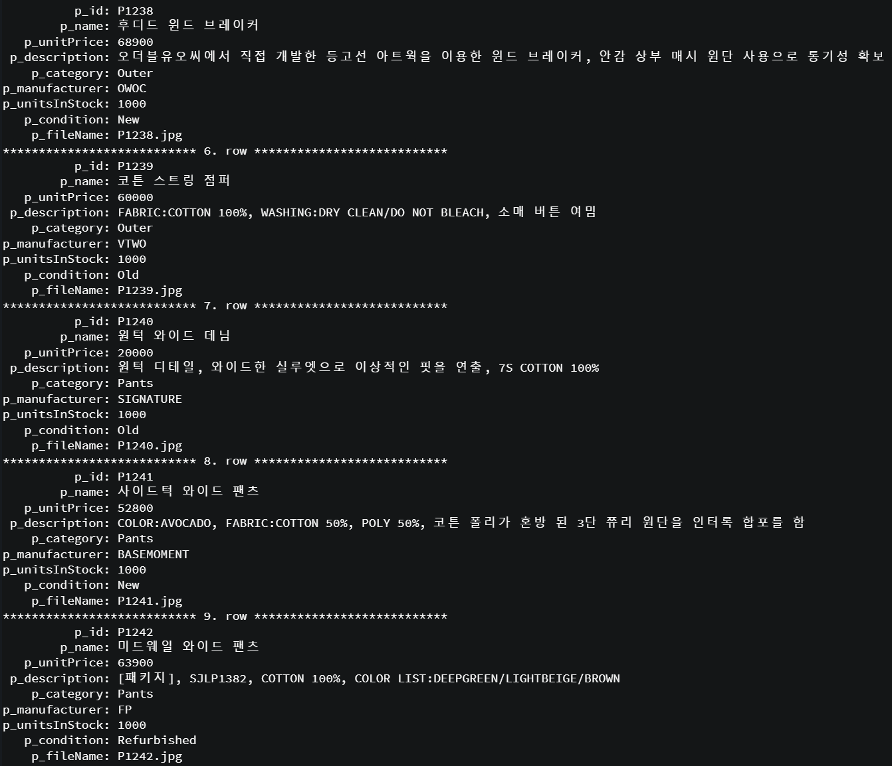
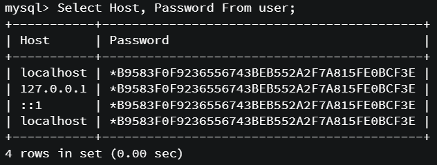

### 2023년 11월 22일 : 쇼핑몰 상품 관리 페이지 추가(2) - 13주차

top_menu_ad.jsp 파일에 상품 수정 메뉴와 삭제 메뉴를 추가해주었다.
product_edit.jsp 파일을 생성하였는데, 해당 상품을 삭제하기 전에 사용자에게 확인 메시지를 표시하는 자바스크립트 코드를 작성하였다.
수정, 삭제를 하기 전에 먼저 상품 정보를 db로부터 출력하였다.
이 product_edit.jsp 페이지를 접근 제한을 하기 위해 기존 web.xml에 url 패턴을 추가 수정하였다.
url-pattern 태그를 사용하여 admin 폴더 안에 있는 product_add.jsp, index_ad.jsp, product_edit.jsp 파일에 제한을 걸었다.
product_update.jsp 파일을 생성해서 관리자 모드에 상품 수정 화면을 구현하였다.
데이터베이스 연결을 수행하고, 상품 정보를 가져왔다. 그리고 상품 수정을 위한 폼을 구성하였고, 폼의 각 입력 필드는 데이터베이스에서 가져온 상품 정보가 초기값으로 설정하였다.
이미지 업로드할 수 있는 파일 입력 필드를 구현하였고, 상품의 상태를 선택할 수 있는 라디오 버튼을 만들었다.
폼을 제출하는 버튼을 누르면 수정된 상품 정보가 서버로 전송한다.
product_update_process.jsp 파일을 생성하여 상품 정보를 수정하고 데이터베이스 업데이트 하는 코드를 구현하였다.
servlet 패키지의 클래스들을 import하고 MultipartRequest 객체를 생성하여 파일 업로드를 처리하였다.
폼으로부터 상품 정보 및 파일명을 가져와서 가격과 재고 수를 적절한 데이터 형으로 변환하였고, 
마지막으로는 데이터베이스 연결을 해제하였다.
상품 수정이 완료되면 다시 상품 수정 페이지로 이동하게 된다.
 
 
* 연습문제 -> 상품 삭제 기능을 구현하였다. 이 삭제 기능은 product_delete.jsp 파일이고, admin 폴더 안에서 생성하였다.
product_delete.jsp 파일에는 mysql 데이터베이스를 연결하여 jdbc 드라이버를 로드하고, 연결 정보를 사용하여 
DriveManager.getConnection을 호출하여 연결해주었다.
id 파라미터를 읽어 오는데 이는 삭제할 상품의 id이다.
sql문을 실행하기 위한 PreparedStatement와 결과를 저장하기 위한 ResultSet을 초기화하였고, 
product 테이브레서 일치하는 상품을 찾기 위해 select 쿼리를 실행하여 
결과가 있으면 지정된 p_id를 가진 레코드를 삭제하는 delete 쿼리를 실행하게 하였다.
결과가 없으면 삭제 대상 상품이 없다는 메시지를 표시하게 하였다.
사용된 rs, pstmt, conn을 해제하고, 상품 삭제가 완료되면 다시 상품 편집 페이지로 이동하게 하였다.
실제로 상품을 삭제하면 페이지와 db에서 상품 정보가 사라지게 된다.
아래 사진은 13주차 연습문제 내용 구현 코드이다. 상품 삭제를 하면 저장돼있던 상품이 삭제가 되기 때문에 
실행되는지 확인을 하였고 다시 지웠던 상품 하나를 추가하여 원 상태로 되돌려 놓은 상태이다.
image 폴더를 확인하면 지웠던 상품을 다시 원래 상태로 추가하여 P1234, P1235가 이미 있는 이미지 파일이기 때문에 
P12341, P12351이라는 이미지 이름으로 새로 생긴 것을 확인할 수 있다.
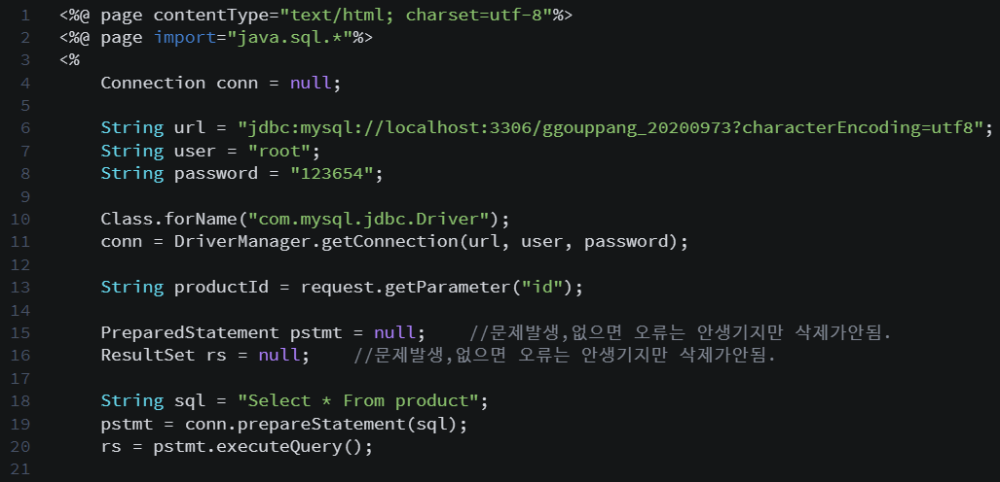
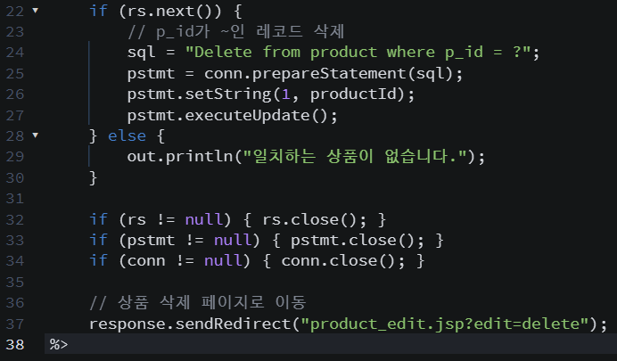

### 2023년 11월 29일 : 쇼핑몰 게시판 추가 - 14주차

이번 주차는 게시판 기능을 구현하였다.
mysql 데이터베이스에 접속하여 board 게시판을 만들 테이블을 생성하였다.
최상위 top_menu.jsp파일에서 메뉴에 게시판(고객센터)을 추가하였다.
web.xml에서 게시판 접속에 필요한 클래스를 서블릿에 등록하였다. 주소 패턴을 .do 방식으로 접근하였다.
src 폴더 안에 mvc 폴더를 만들고 또 그 안에 database 폴더를 만들어서 Db_connection.java 파일을 생성하였다.
db에 접근하게 하였다. 그리고 Board_dto.java 파일을 생성하여 게시판 데이터 구조와 Set, Get 메소드를 정의하였다.
src 폴더 안에 mvc 폴더 안에 model 폴더를 만들어 Board_dao.java를 생성하였다. 인스턴스 객체를 생성하고 게시판을 조회, 수정, 삭제 할 수 있는 sql 기능을 구현하였다.
board 테이블의 레코드 개수를 구하는 코드, board 테이블의 레코드를 가져오는 코드, member 테이블에서 인증된 id의 사용자명을 가져오는 코드, board 테이블에 새로운 글을 삽입하는 코드, 선택된 글의 조회수를 증가시키는 코드, 선택된 글의 상세 내용을 가져오는 코드, 선택된 글 내용을 수정하는 코드, 선택된 글을 삭제하는 코드를 구현하였다.
src 폴더 안에 mvc 폴더 안에 controller 폴더를 만들어 Board_controller.java 파일을 생성하였다.
servlet-api.jar 라이브러리를 연동하였다. 터미널에 명령어 'cp servlet-api.jar /workspace/JSP_MAIN_20200973/WEB-INF/lib/'를 입력해주었다.
최상위에 board 폴더를 생성하고 안에 board_list.jsp 파일을 생성하였다.
이 파일은 jstl을 사용하기 위해 태그 라이브러리를 import 하였고, 게시판 목록을 테이블 형식으로 나타내었다.
페이지 링크를 생성하여 페이지를 이동할 수 있도록 하였고, 검색 기능을 제공하며 글쓰기 버튼을 클릭하면 함수를 통해 로그인 상태를 확인한 후 글쓰기 페이지로 이동하게 구현하였다.
jstl-1.2.jar 라이브러리를 다운로드하여 WEB-INF lib 폴더 안에 넣어주었다.
board 폴더 안에 board_writeform.jsp를 생성하였다.
마찬가지로 jstl을 사용ㅎ기 위해 태그 라이브러리를 import 하였고, 폼 제출 시 입력값이 비어있는지 확인하는 자바스크립트 함수를 정의하였다.
게시판 글을 작성하는 폼은 세션에서 받아온 이름을 기본값으로 설정한 입력 폼을 제공한다.
board 폴더 안에 board_view.jsp 파일을 생성하였다.
이 파일도 jstl의 태그 라이브러리를 import 하였고, 수정할 게시글의 내용을 입력할 수 있는 폼을 제공하였다.
게시글의 성명, 제목, 내용을 수정할 수 있다.
 
 
* 연습문제 -> 해결하지 못하였다.

### 수업 이외에 기능을 추가로 구현한 것에 대하여...

* 1. login.jsp 파일에서 마우스의 이동을 감지하여 10초 동안 움직이지 않았을 경우 index.jsp 파일로 이동하는 코드를 구현하였다.
아래 사진은 마우스의 이동을 감지하는 코드와 실제 화면이다.
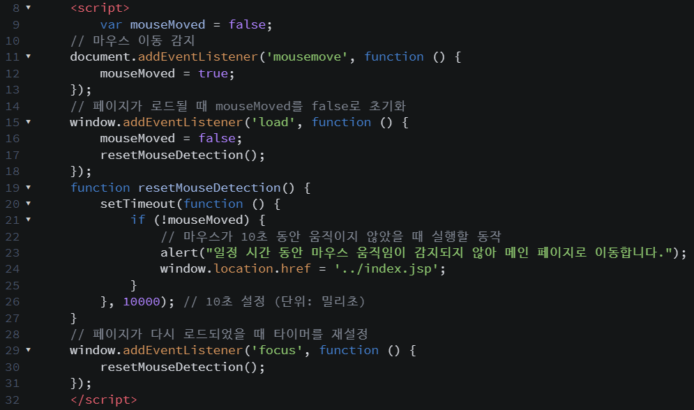
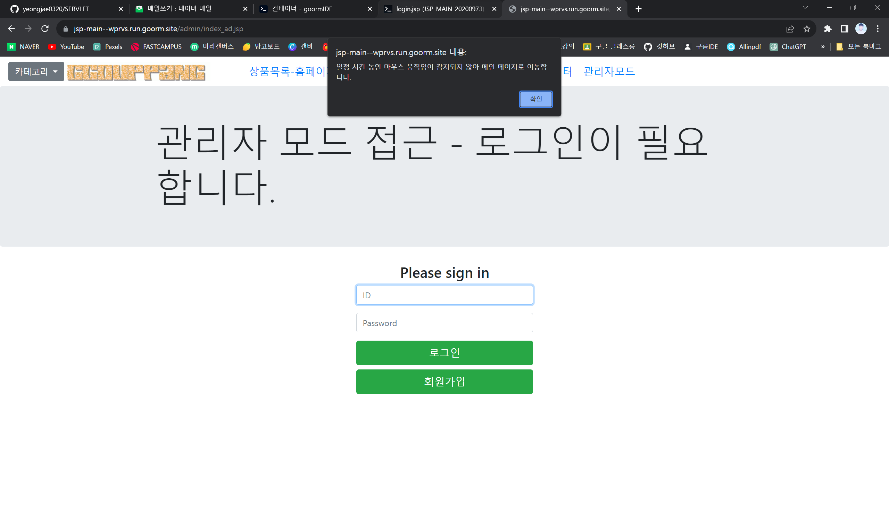